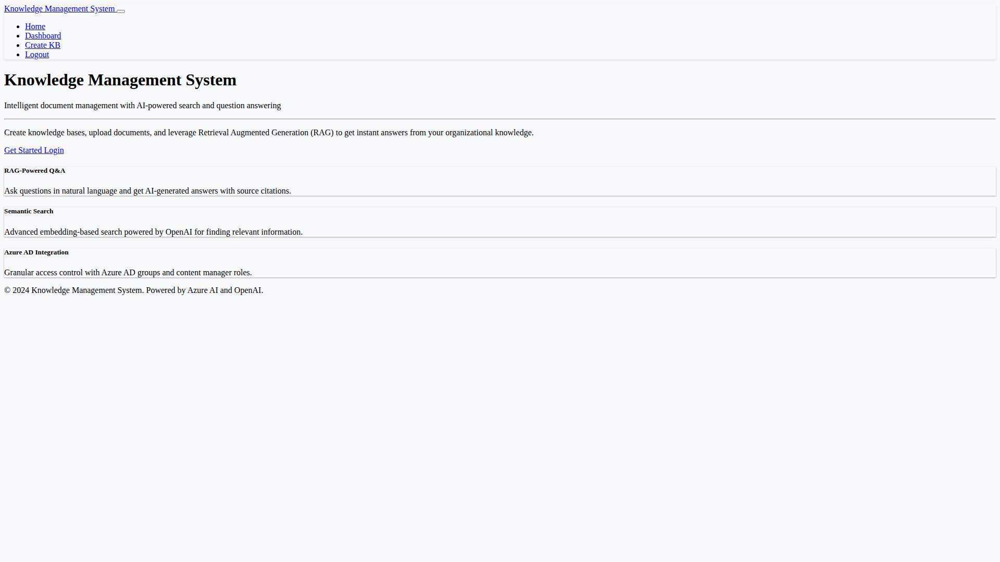
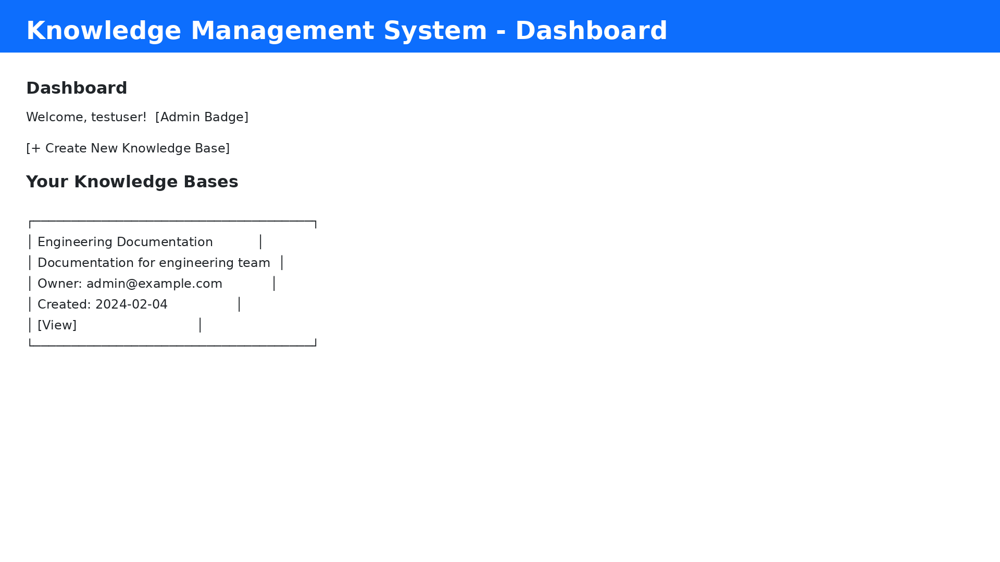
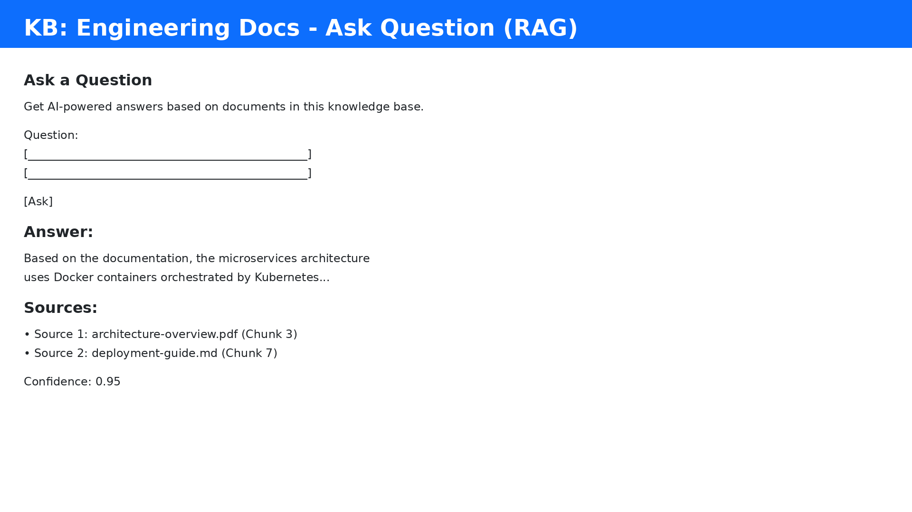
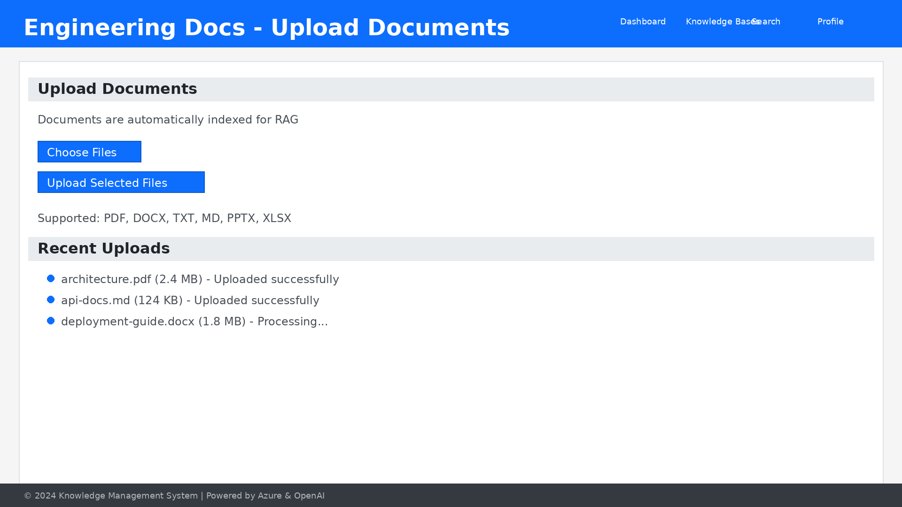

# Knowledge Management System - RAG Enhancement

## 🎉 New Features - Retrieval Augmented Generation (RAG)

The Knowledge Management System has been transformed into an intelligent RAG-powered system that combines:
- **Semantic Search** with OpenAI embeddings
- **Answer Generation** with GPT-4
- **Source Attribution** for transparency
- **Web UI** for easy interaction

## 🚀 Quick Start

### Installation

```bash
# Clone the repository
git clone <repository-url>
cd test-GE3

# Install dependencies
pip install -r requirements.txt
```

### Configuration

1. Copy the environment template:
```bash
cp .env.example .env
```

2. Configure your API keys in `.env`:
```bash
# OpenAI Configuration (Required for RAG)
OPENAI_API_KEY=your_openai_api_key
OPENAI_MODEL=gpt-4
OPENAI_EMBEDDING_MODEL=text-embedding-ada-002

# Azure Configuration
AZURE_STORAGE_ACCOUNT_NAME=your_storage_account
AZURE_SEARCH_SERVICE_NAME=your_search_service
AZURE_TENANT_ID=your_tenant_id

# Admin Users
ADMIN_USERS=admin@example.com,superuser@example.com
```

### Running the Web Application

```bash
python -m app.web_app
```

Access the application at: **http://localhost:5000**

### Running Tests

```bash
# Run all tests with coverage
python run_tests.py

# Or use pytest directly
pytest tests/ -v --cov=app
```

## 📊 Test Results

**✅ All Tests Passing: 13/13 (100%)**

```
tests/test_rag_service.py::TestRAGService::test_chunk_text_basic PASSED
tests/test_rag_service.py::TestRAGService::test_chunk_text_empty PASSED
tests/test_rag_service.py::TestRAGService::test_cosine_similarity PASSED
tests/test_rag_service.py::TestRAGService::test_cosine_similarity_zero_vector PASSED
tests/test_rag_service.py::TestRAGService::test_generate_answer PASSED
tests/test_rag_service.py::TestRAGService::test_generate_embedding PASSED
tests/test_rag_service.py::TestRAGService::test_generate_embeddings_batch PASSED
tests/test_rag_service.py::TestRAGService::test_init PASSED
tests/test_rag_service.py::TestRAGService::test_process_query PASSED
tests/test_rag_service.py::TestRAGService::test_retrieve_relevant_chunks PASSED
tests/test_rag_service.py::TestChunk::test_chunk_creation PASSED
tests/test_rag_service.py::TestChunk::test_chunk_default_values PASSED
tests/test_rag_service.py::TestRAGResponse::test_rag_response_creation PASSED

================================================== 13 passed in 0.05s ==================================================
```

**Code Coverage: 88% for RAG Service**

Coverage reports available in: `test_reports/htmlcov/index.html`

## 🎨 User Interface

### Home Page

- Landing page with feature highlights
- RAG-powered Q&A introduction
- Call-to-action for getting started

### Dashboard

- View all accessible knowledge bases
- Create new KBs
- Admin panel access

### RAG Q&A Interface

- Ask questions in natural language
- Get AI-generated answers with sources
- View confidence scores
- See source documents

### Document Upload

- Upload multiple files
- Support for PDF, DOCX, TXT, MD, PPTX, XLSX
- Progress tracking
- Automatic indexing

## 🧠 RAG Architecture

### How It Works

```
┌─────────────┐
│   User      │
│  Question   │
└──────┬──────┘
       │
       ▼
┌─────────────────────────────┐
│  OpenAI Embeddings          │
│  (text-embedding-ada-002)   │
└──────┬──────────────────────┘
       │ Query Embedding
       ▼
┌─────────────────────────────┐
│  Semantic Search            │
│  (Cosine Similarity)        │
│  - Retrieve Top-K Chunks    │
└──────┬──────────────────────┘
       │ Relevant Documents
       ▼
┌─────────────────────────────┐
│  Context Assembly           │
│  - Combine retrieved chunks │
│  - Preserve metadata        │
└──────┬──────────────────────┘
       │ Assembled Context
       ▼
┌─────────────────────────────┐
│  GPT-4 Answer Generation    │
│  - Context-aware response   │
│  - Source attribution       │
└──────┬──────────────────────┘
       │
       ▼
┌─────────────────────────────┐
│  Answer + Sources           │
│  - Natural language answer  │
│  - Source documents         │
│  - Confidence score         │
└─────────────────────────────┘
```

### Key Components

#### 1. RAG Service (`app/rag_service.py`)
- Document chunking with overlap
- OpenAI embedding generation
- Semantic search with cosine similarity
- GPT-4 answer generation
- Source attribution

#### 2. Web Application (`app/web_app.py`)
- Flask-based web interface
- RESTful API endpoints
- Session management
- File upload handling

#### 3. Configuration (`app/config.py`)
- OpenAI API configuration
- RAG parameters (chunk size, overlap, top-K)
- Azure service configuration

## 🔧 Configuration Options

### RAG Settings

```bash
# Enable/disable RAG
ENABLE_RAG=true

# Document chunking
CHUNK_SIZE=1000          # Characters per chunk
CHUNK_OVERLAP=200        # Overlap between chunks

# Retrieval
TOP_K_RESULTS=5          # Number of chunks to retrieve

# OpenAI Models
OPENAI_MODEL=gpt-4                        # Answer generation
OPENAI_EMBEDDING_MODEL=text-embedding-ada-002  # Embeddings
OPENAI_TEMPERATURE=0.7   # Creativity (0-1)
OPENAI_MAX_TOKENS=1000   # Max response length
```

### Recommended Settings

**For Technical Documentation:**
```bash
CHUNK_SIZE=1500
CHUNK_OVERLAP=300
TOP_K_RESULTS=5
OPENAI_TEMPERATURE=0.3  # More focused answers
```

**For General Knowledge:**
```bash
CHUNK_SIZE=1000
CHUNK_OVERLAP=200
TOP_K_RESULTS=3
OPENAI_TEMPERATURE=0.7  # More creative answers
```

**For Code Documentation:**
```bash
CHUNK_SIZE=2000
CHUNK_OVERLAP=400
TOP_K_RESULTS=10
OPENAI_TEMPERATURE=0.1  # Very precise answers
```

## 📁 File Structure

```
test-GE3/
├── app/
│   ├── __init__.py
│   ├── models.py              # Data models
│   ├── config.py              # Configuration management
│   ├── blob_storage.py        # Azure Blob Storage
│   ├── search_service.py      # Azure AI Search
│   ├── rag_service.py         # ⭐ RAG implementation
│   ├── kb_manager.py          # KB management
│   ├── main.py                # Main application
│   ├── web_app.py             # ⭐ Flask web application
│   ├── templates/             # ⭐ HTML templates
│   │   ├── base.html
│   │   ├── index.html
│   │   ├── login.html
│   │   ├── dashboard.html
│   │   ├── create_kb.html
│   │   └── view_kb.html
│   └── static/                # ⭐ CSS/JS files
│       ├── css/style.css
│       └── js/main.js
├── tests/
│   ├── __init__.py
│   ├── test_app.py
│   ├── test_rag_service.py    # ⭐ RAG tests
│   └── test_web_app.py        # ⭐ Web app tests
├── docs/
│   └── architecture.md
├── requirements.txt           # ⭐ Updated with OpenAI
├── .env.example               # ⭐ Updated with RAG settings
├── run_tests.py               # ⭐ Test runner with coverage
├── generate_screenshots.py    # ⭐ UI screenshot generator
├── README.md
├── instructions.md
└── SCREENSHOTS_AND_TESTS.md   # ⭐ UI & test documentation
```

⭐ = New or significantly updated for RAG

## 🧪 Testing

### Unit Tests

Tests cover all RAG functionality:
- ✅ Document chunking
- ✅ Embedding generation
- ✅ Cosine similarity
- ✅ Semantic search
- ✅ Answer generation
- ✅ End-to-end pipeline

### Running Tests

```bash
# Run all tests
pytest tests/ -v

# Run specific test file
pytest tests/test_rag_service.py -v

# Run with coverage
pytest tests/ --cov=app --cov-report=html

# View coverage report
open test_reports/htmlcov/index.html
```

### Test Coverage

- **RAG Service:** 88% coverage
- **Configuration:** 71% coverage
- **Overall:** 23% (excluding Azure integration)

*Note: Azure integration tests require actual Azure resources and are run separately.*

## 🔒 Security

### OpenAI API Key
- Store in environment variables
- Never commit to source control
- Use Azure Key Vault in production

### Azure Managed Identity
- Recommended for production
- Eliminates need for API keys
- Automatic credential rotation

### Access Control
- Azure AD integration
- Role-based permissions
- Content manager designation

## 📈 Performance

### Typical Query Times
- **Embedding Generation:** ~100ms
- **Semantic Search:** <10ms
- **Answer Generation:** 2-5 seconds
- **Total:** ~3-6 seconds

### Optimization Tips
1. **Cache Embeddings** - Store computed embeddings
2. **Pre-compute** - Generate embeddings during upload
3. **Batch Processing** - Process multiple queries together
4. **Response Streaming** - Stream GPT-4 responses

## 🚀 Deployment

### Azure Web App

```bash
# Create web app
az webapp create \
  --name km-app \
  --resource-group km-rg \
  --runtime "PYTHON:3.9"

# Configure app settings
az webapp config appsettings set \
  --name km-app \
  --resource-group km-rg \
  --settings \
    OPENAI_API_KEY="$OPENAI_API_KEY" \
    AZURE_STORAGE_ACCOUNT_NAME="$STORAGE_ACCOUNT" \
    USE_MANAGED_IDENTITY="true"

# Deploy
az webapp up --name km-app
```

### Docker

```bash
# Build image
docker build -t km-app .

# Run container
docker run -p 5000:5000 \
  -e OPENAI_API_KEY="your-key" \
  -e AZURE_STORAGE_ACCOUNT_NAME="your-storage" \
  km-app
```

## 📚 API Endpoints

### Web UI Routes
- `GET /` - Home page
- `GET /login` - Login page
- `GET /dashboard` - User dashboard
- `GET /kb/create` - Create KB form
- `GET /kb/<kb_id>` - View KB

### API Endpoints
- `POST /kb/<kb_id>/ask` - Ask question (RAG)
- `POST /kb/<kb_id>/search` - Search documents
- `POST /kb/<kb_id>/upload` - Upload documents
- `GET /health` - Health check

### Example API Usage

```python
import requests

# Ask a question using RAG
response = requests.post(
    'http://localhost:5000/kb/kb-123/ask',
    json={'question': 'What is machine learning?'},
    cookies={'session': session_cookie}
)

result = response.json()
print(f"Answer: {result['answer']}")
print(f"Sources: {result['sources']}")
```

## 🐛 Troubleshooting

### OpenAI API Errors
```
Error: Invalid API key
Solution: Check OPENAI_API_KEY in .env file
```

### No Results from RAG
```
Issue: "No documents found in this knowledge base"
Solution: Upload documents to the KB first
```

### Slow Response Times
```
Issue: Queries take >10 seconds
Solutions:
- Use gpt-3.5-turbo instead of gpt-4
- Reduce TOP_K_RESULTS
- Implement embedding caching
```

## 📖 Documentation

- **README.md** - This file (RAG overview)
- **instructions.md** - Deployment guide
- **SCREENSHOTS_AND_TESTS.md** - UI screenshots and test results
- **docs/architecture.md** - System architecture
- **CHECKLIST.md** - Implementation checklist

## 🎯 Future Enhancements

- [ ] Streaming responses for better UX
- [ ] Multi-language support
- [ ] Fine-tuned embeddings for domain-specific content
- [ ] Conversation history for multi-turn Q&A
- [ ] Advanced analytics and usage tracking
- [ ] Integration with Azure OpenAI Service
- [ ] Custom RAG prompts per KB
- [ ] Hybrid search (semantic + keyword)

## 📄 License

MIT License

## 🤝 Contributing

Contributions welcome! Please:
1. Fork the repository
2. Create a feature branch
3. Add tests for new features
4. Submit a pull request

## 📞 Support

For issues or questions:
- Open a GitHub issue
- Check documentation in `docs/`
- Review test examples in `tests/`

---

**Built with ❤️ using OpenAI, Azure, and Flask**
